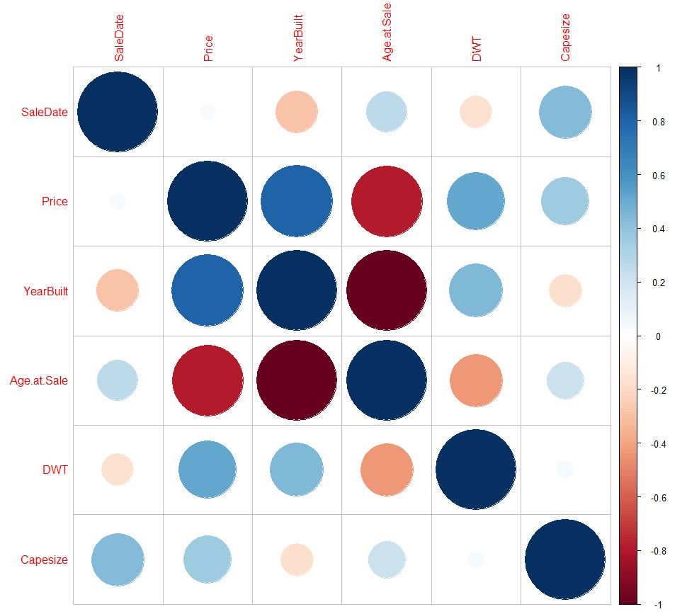
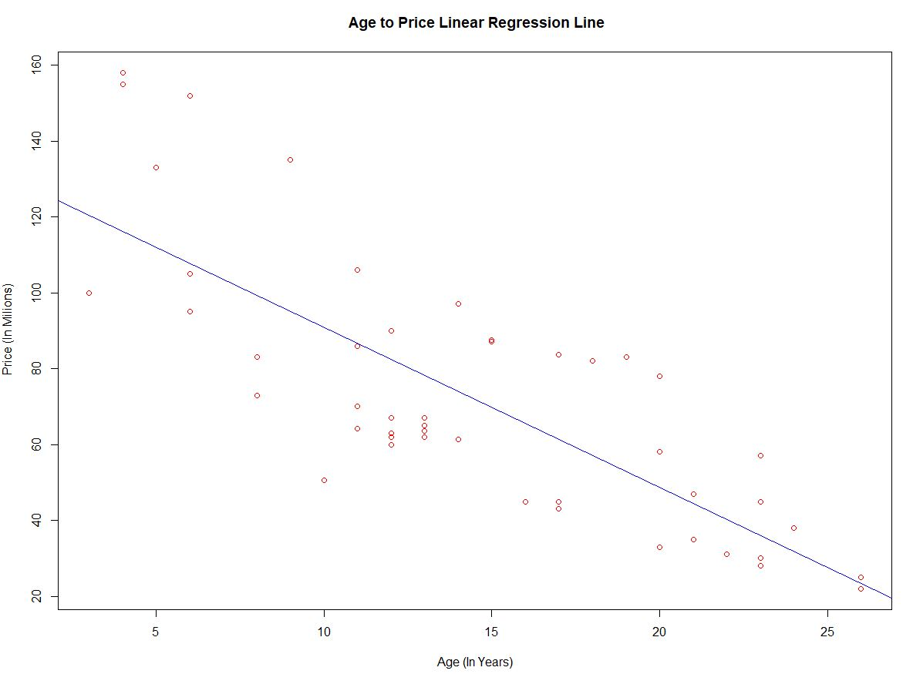
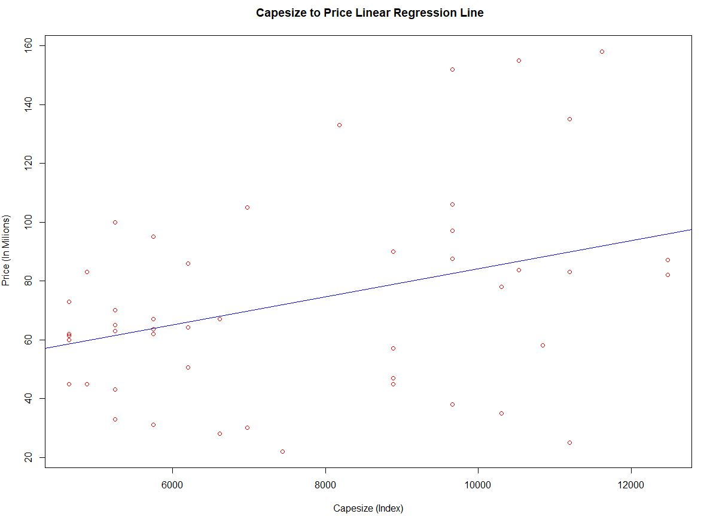
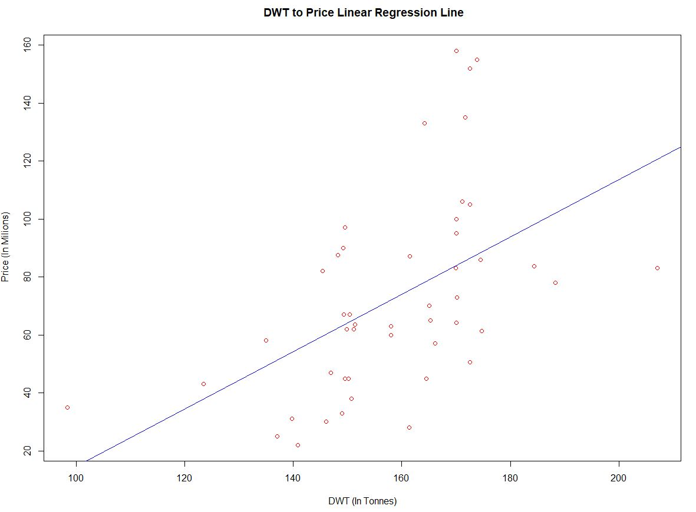

# Harvard-Business-Case-Study-on-Ship-Valuation

Overview : 

Compass Maritime Services offers consulting services for clients who are interested in purchasing and selling maritime ships and offshore vessels. Basil Karatzas, director for projects and finance will help the client who is interested in purchasing a ship named BetPerformer, to determine the valuation and negotiation strategy of the ship. This report will show methodology, valuation analysis, concerns, best value and also suggest the bid price for the ship. The value accounts for all variables provided and gives the client the best chance to secure Bet Performer for its current market value.

Bet Performer:

Bet Performer is a bulk carrier with 172000 DWT and 12479 Capesize index. The ship is 11 years old and was built in Japan in 1997. This ship has a MAN-B&W engine with an engine power of 14710 KW and has nine holds and hatches. The same ship was sold two years back under a different name Mineral Poterne for $70 million.

Variables

Data consists of recent Sale Date, Vessel Name, Price, Sale Year, Year Built, DWT and Capesize. The weight of these ships is measured in deadweight tons and is the sum of cargo, fuel, fresh water, passengers and crew weights. DWT for Capesize is greater than 100000. The baltic dry index calculates multiple shipping costs for different raw materials among various routes.Year built and Age at Sale represents the same factor. Age at Sale is the best predictor of the price when compared to other variables owing to the highest correlation. DWT and Capesize also has a significant correlation with the price of the ship and can affect the price. Sale Date has the least correlation and lowest influence on the price. In addition to the data collected about similar ships factors such as main engine type, repairs, building company reputation, charter contracts with counter-parties, loading equipment, shipyard and location of the ship at the time sale also influence the price of the ship.

Correlation:

The below matrix shows the correlation between all the variables in the data set. 

Corplot:

Variable Selction: 
Based on the correlation we have removed the two variables SaleDate and YearBuilt.

Linear Model: 

We fit a linear model to predict the price of the ship by using each of the remaining variables individually.However, this approach of fitting a separate simple linear regression model for each predictor is not entirely satisfactory. First of all, it is unclear how to make a single prediction of Price given levels of the three variables Age at Sale, Deadweight tonnage (DWT) and Capesize Index, since each of the variables is associated with a separate regression equation. Second, each of the three regression equations ignores the other two variables in forming estimates for the regression coefficients. If these independent variables are correlated with each other in the ship data, then this can lead to very misleading estimates of the individual effects on Price. Instead of fitting a separate simple linear regression model for each predictor, a better approach is to directly accommodate multiple predictors. 

We moved on to fit the linear model to predict with all the three variables together. 

Model Summary:

92 % of the variation in the sale price of ships could be explained by Age, DWT, and Capesize.

We went ahead and used this model to predict the price of the Bet Performer. The predicted price as per multiple linear regression came out to be $125.83 M.

The confidence interval for the prediction is between 118.8899 and 132.7692

Further Analysis

Analyzing the whole dataset, there are certain observations to be noticed. We plotted the histogram for the original price for all the 48 ships which were studied.

The dataset was segregated into two buckets, one has a price less than $100 M and the other having price greater than $100 M. For the first set of ships having majority of ships (85%), the average of prediction error was 0.8 (Negative) which signifies that the model worked accurately for the 85 % of the ships and the predicted price was overpriced just by 0.8 M. The results were startling for the other set of ships which accounts for 15 % of dataset . The predicted price deviated a lot from the original price. This accounts because there are very few ships having a price greater than $ 100M. The ships were underpriced by $6.36 M at an average.

The above inference was considered to adjust the underpriced prediction. The final price predicted for Bet Performer as per our case study will be $ 132.19 M.

Conclusion

The purpose of analysis was to come up with the predicted price of Bet Performer which would fall under both the client and the seller's satisfaction. We did a detailed study using the Market Approach as the base and came to a final price of $ 132.19M for the Bet Performer which we think will be the amount to bid and successfully buy the bulk carrier ship which the client had interest in.
